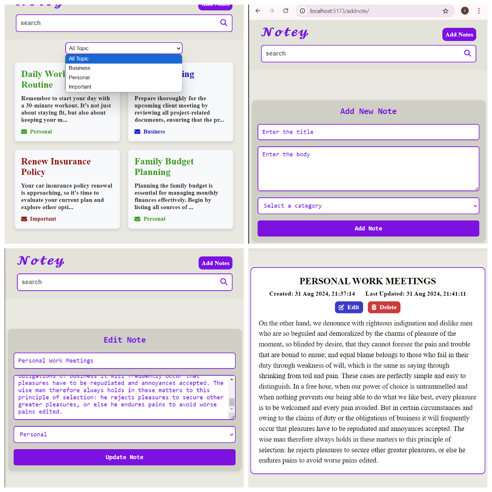

# Notey App

This is a full stack application with a Django REST API backend and a React frontend. The backend serves as the API provider, while the frontend allows users to interact with the data.


## Project Structure

- **Backend**: `notes_app` - Built with Django REST Framework.
- **Frontend**: `react-note-app` - Built with React.js.

## Requirements

- Python 3.x
- Node.js (v14.x or above)
- npm (comes with Node.js)
- Virtual environment (recommended for Python dependencies)

## Getting Started

### Backend Setup (Django)

1. **Navigate to the backend folder:**

   ```bash
   cd notes_app
   ```
2. **Create a virtual environment**
```bash
   python -m venv venv
   venv\Scripts\activate  # windows
   source venv/bin/activate # macOS/Linux
```
3. **Install the required dependencies:**
```bash
pip install -r requirements.txt
```
4. **Database Setup**
```bash
   python manage.py makemigrations
   python manage.py migrate
```
5. **Start the Django server on port 8000**
```bash
  python manage.py runserver 8000
```
- The backend API will be available at: http://127.0.0.1:8000/

### Frontend Setup (React)

1. **Navigate to the frontend folder:**

   ```bash
   cd react-note-app
   ```
2. **Install the dependencies**
   ```bash
    npm install
   ```
3. **Start the React development server**
   ```bash
    npm run dev
   ```
- The frontend will be available at: http://localhost:5173/
   
   ### CORS Setup:
- Make sure that the `CORS` settings in your Django settings file (`settings.py`) are configured to allow requests from `http://localhost:5173`.
 
